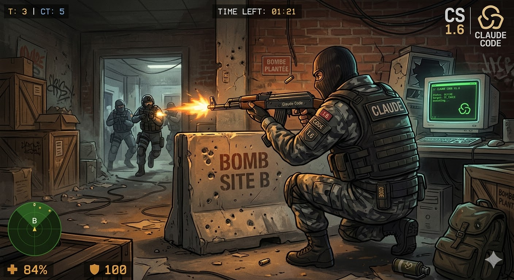

# Claude Code CS 1.6 Sound Effects



Turn your [Claude Code](https://docs.anthropic.com/en/docs/claude-code) sessions into a Counter-Strike 1.6 match with iconic sound effects on every hook event.

> **macOS only** — uses `afplay` for audio playback.

## Sound Mapping

| Hook | Sound | When |
|---|---|---|
| `SessionStart` | `locknload.wav` | "Lock and load" — session starts |
| `SessionEnd` | `rounddraw.wav` | "Round draw" — session ends |
| `Stop` | `ctwin.wav` | "Counter-Terrorists win" — task completed |
| `PostToolUse` (AskUserQuestion) | `ct_reportingin.wav` | "Reporting in" — Claude asks you a question |
| `PostToolUse` (ExitPlanMode) | `bombdef.wav` | "Bomb has been defused" — plan finalized |
| `Elicitation` | `com_reportin.wav` | "Report in" — form displayed |
| `PostToolUseFailure` | `ct_imhit.wav` | "I'm hit" — a tool call fails |
| `SubagentStart` | `com_go.wav` | "Go go go" — subagent launched |
| `SubagentStop` | `roger.wav` | "Roger that" — subagent finished |
| `PermissionRequest` | `ct_backup.wav` | "Need backup" — permission requested |
| `UserPromptSubmit` | `ct_affirm.wav` | "Affirmative" — you send a message |
| `TaskCompleted` | `enemydown.wav` | "Enemy down" — background task completed |

## Installation

```bash
git clone git@github.com:yagami271/claude-cs16-sounds.git
cd claude-cs16-sounds
./install.sh
```

The installer will:
1. Copy all `.wav` files to `~/.claude/sounds/`
2. Add the hooks configuration to `~/.claude/settings.json`

If you already have hooks configured, it will save the new hooks to `hooks.json` for you to merge manually.

Restart Claude Code after installation.

## Uninstall

```bash
./uninstall.sh
```

## Manual Installation

If you prefer to configure manually without running the install script:

**1. Copy the sounds**

```bash
mkdir -p ~/.claude/sounds
cp sounds/*.wav ~/.claude/sounds/
```

**2. Edit your Claude Code settings**

Open (or create) `~/.claude/settings.json` and add the `hooks` key from [`hooks-reference.json`](hooks-reference.json):

```json
{
  "hooks": {
    "SessionStart": [
      { "hooks": [{ "type": "command", "command": "afplay ~/.claude/sounds/locknload.wav &" }] }
    ],
    "SessionEnd": [
      { "hooks": [{ "type": "command", "command": "afplay ~/.claude/sounds/rounddraw.wav &" }] }
    ],
    "Stop": [
      { "hooks": [{ "type": "command", "command": "afplay ~/.claude/sounds/ctwin.wav &" }] }
    ],
    "PostToolUse": [
      { "matcher": "AskUserQuestion", "hooks": [{ "type": "command", "command": "afplay ~/.claude/sounds/ct_reportingin.wav &" }] },
      { "matcher": "ExitPlanMode", "hooks": [{ "type": "command", "command": "afplay ~/.claude/sounds/bombdef.wav &" }] }
    ],
    "Elicitation": [
      { "hooks": [{ "type": "command", "command": "afplay ~/.claude/sounds/com_reportin.wav &" }] }
    ],
    "PostToolUseFailure": [
      { "hooks": [{ "type": "command", "command": "afplay ~/.claude/sounds/ct_imhit.wav &" }] }
    ],
    "SubagentStart": [
      { "hooks": [{ "type": "command", "command": "afplay ~/.claude/sounds/com_go.wav &" }] }
    ],
    "SubagentStop": [
      { "hooks": [{ "type": "command", "command": "afplay ~/.claude/sounds/roger.wav &" }] }
    ],
    "PermissionRequest": [
      { "hooks": [{ "type": "command", "command": "afplay ~/.claude/sounds/ct_backup.wav &" }] }
    ],
    "UserPromptSubmit": [
      { "hooks": [{ "type": "command", "command": "afplay ~/.claude/sounds/ct_affirm.wav &" }] }
    ],
    "TaskCompleted": [
      { "hooks": [{ "type": "command", "command": "afplay ~/.claude/sounds/enemydown.wav &" }] }
    ]
  }
}
```

> If you already have a `settings.json` with other keys (`enabledPlugins`, etc.), merge the `hooks` section into your existing file.

**3. Restart Claude Code**

## Customization

All 45 CS 1.6 sounds are included in the `sounds/` directory. Feel free to swap any sound by editing `~/.claude/settings.json` and changing the filename. Available sounds:

```
blow.wav         bombdef.wav       bombpl.wav        circleback.wav
clear.wav        com_followcom.wav com_getinpos.wav  com_go.wav
com_reportin.wav ct_affirm.wav     ct_backup.wav     ct_coverme.wav
ct_enemys.wav    ct_fireinhole.wav ct_imhit.wav      ct_inpos.wav
ct_point.wav     ct_reportingin.wav ctwin.wav        elim.wav
enemydown.wav    getout.wav        go.wav            hitassist.wav
hosdown.wav      letsgo.wav        locknload.wav     matedown.wav
meetme.wav       moveout.wav       negative.wav      position.wav
regroup.wav      rescued.wav       roger.wav         rounddraw.wav
sticktog.wav     stormfront.wav    takepoint.wav     terwin.wav
vip.wav          ...
```

## Requirements

- macOS (uses `afplay`)
- [Claude Code](https://docs.anthropic.com/en/docs/claude-code) CLI

## License

MIT
